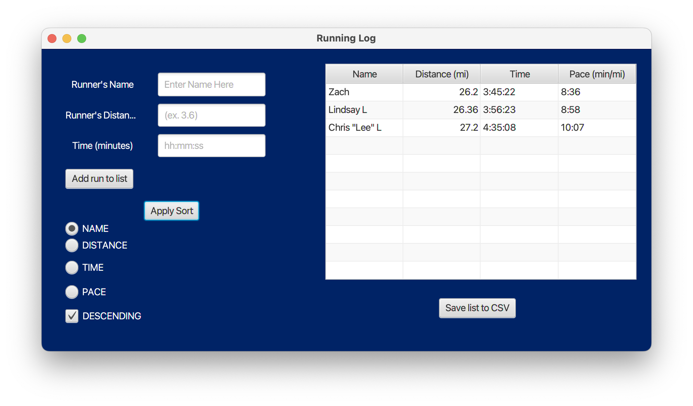

## Java-2 Final Project Repo
### This is the repository for my final project in Java 2!

A JavaFX Runners Log application that demonstrates the usage of Scene Builder. This project is built using Java and Maven.

## Project Overview

This application is a user friendly running log that demonstrates core concepts in UI development, allowing for a visual approach to UI development.

To run this project, you need:

- Java JDK 17 or later
- Maven 3.6 or later
- JavaFX runtime

### Author: Zach Lariccia (zachsarc)

## Example of working program

